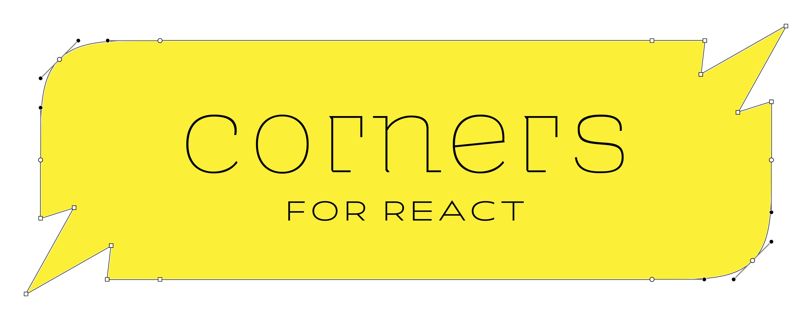

<hr>
<div align="center">
  
</div>

<br>

<p align="center">
  <a href="https://bundlephobia.com/result?p=corners">
    
  </a>
  <a aria-label="Types" href="https://www.npmjs.com/package/corners">
    
  </a>
  <a aria-label="Build status" href="https://github.com/jeremybanka/corners/actions/workflows/pipeline.yml">
    
  </a>
  <a aria-label="NPM version" href="https://www.npmjs.com/package/corners">
    
  </a>
  <a aria-label="License" href="https://github.com/jeremybanka/corners/blob/main/LICENSE">
    
  </a>
</p>

```shell
npm i corners
```
```shell
yarn add corners
```
<hr>

Create react components with angled or smooth-rounded corners.

## Features

- [x] Use one of the preset component factories like `rounded`: `const MyButton = rounded.button`
- [x] Make your own component factory with `corners`: `const dogEared = corners(chamfer, null, null, null).size(40)`
- [x] CSS clip-path ensures corners are rendered as empty space
- [x] Components may be dynamically sized: a resize observer is used to detect changes to component size and update the clip-path
- [ ] Specify the corner size when calling a factory (e.g. `rounded.cornerSize(10).div`)
- [ ] Support for drop shadows (e.g. `corners(round).options({shadow: {...}}).div`)
- [ ] Support for positioning elements outside of the target element
## API

### corners(...cornerFns).size(cornerSize)

```jsx harmony
import type { FC } from "react"
import corners, { chamfer } from "corners"

const upperLeftDogeared = corners(null, null, null, chamfer).size(20)

const DogearedDiv = upperLeftDogeared.div

const MyComponent: FC = () => (
  <DogEaredDiv style={{ background: "black" }}>
    Hello, World!
  </DogEaredDiv>
)

```

| Argument   | Type                                             | Required? | Description                                                                       |
| ---------- | ------------------------------------------------ | --------- | --------------------------------------------------------------------------------- |
| cornerFns  | <code>Maybe<[DrawCorner](#draw-corner)>[]</code> | Yes       | 1, 2, or 4 functions that specify the corners for this factory in clockwise order |
| cornerSize | number                                           | Yes       | Equivalent to the `N`px given in css `border-radius`                              |


## LICENSE

MIT
